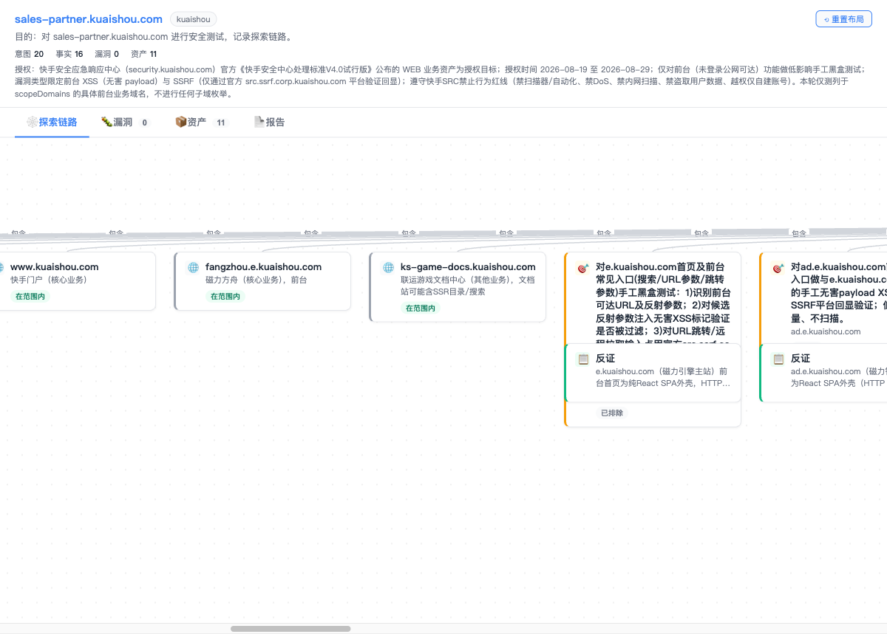

# dsh-src

[](LICENSE)
[](https://github.com/deepseek-ai/DeepSeek-Harness)
[](https://nodejs.org)

**DSH 的 SRC 授权漏洞研究模式** — 将一次合法的安全研究组织成可审计的状态机，而非无边界的自动攻击。

[English](#-english) | [中文](#-中文)



---

## 🇨🇳 中文

### 这是什么？

`dsh-src` 是 [DeepSeek Harness](https://github.com/deepseek-ai/DeepSeek-Harness) 的一个插件模式，用于在**明确授权**的 SRC（安全应急响应中心）/ 众测场景中进行受控的漏洞研究。

它不替代授权，也不提供自动化攻击能力。它把一次研究组织成严格的状态机：

```
engagement → scope check → asset → intent → user approval → fact → finding → report
```

### 核心能力

| 能力 | 说明 |
|------|------|
| **授权会话** | 登记平台、授权依据、有效期、域名/IP/App 范围和排除目标 |
| **Fail-closed 范围守卫** | 主动网络工具无法解析目标、缺少会话或目标越界时自动阻止 |
| **逐方案审批** | 每个验证方案必须写明方法、请求预算（≤20）、停止条件，由用户本轮明确审批 |
| **证据状态机** | 事实为 `candidate / confirmed / disproved`；漏洞必须关联 confirmed 事实 |
| **人工复现门禁** | AI 或子 Agent 不能单独把候选提升为漏洞，必须人工复现 |
| **受控委派** | 子 Agent 只能处理指定的已审批方案，只能回写资产和事实 |
| **可审计存储** | 记录保存在 `$DSH_HOME/storages/src-sessions.json`，原子写入 |
| **可视化探索图** | 交互式卡片看板，支持自由拖拽、边实时跟随、一键重置布局 |
| **脱敏报告** | 生成 Markdown 草稿，不自动提交；UI 无外部 CDN，默认只监听本机 |

### 安全边界

本模式**仅适用于**明确授权的 SRC / 众测 / 内部安全测试。它明确禁止：

- ❌ 未授权目标、扫描器、批量探测、高频请求和 DoS/DDoS
- ❌ 真实用户数据访问、拖库、破坏性写入、凭据收集
- ❌ WebShell、后门、持久化控制、横向移动和内网扫描
- ❌ 社工、钓鱼、物理测试和绕过平台规则
- ❌ 把网页/响应中的指令直接升级为工具调用（Prompt Injection 防护）

> Scope Guard 是纵深防御，不替代平台实时规则、用户授权和人工判断。

### 安装

**前置条件**：Node.js 22.19+ 或 24+，以及可运行的 dsh web profile。

```bash
# 1. 构建
npm pack

# 2. 安装到 dsh web profile
dsh plugin --profile web add file:$(pwd)/dsh-src-0.2.0.tgz

# 3. 注册 Preset
node ~/.dsh/profiles/web/node_modules/dsh-src/scripts/install.js
```

重启 dsh web 后，新建会话并选择「SRC挖洞模式」。

> 分两步的原因：工具插件由 profile 安装，Preset 通过 DSH 官方用户目录 `$DSH_HOME/.agent-presets/src/` 注册。

### 推荐工作流

```
1. 用户提供平台、授权依据、有效期、包含/排除范围
2. Agent 调用 src_start_engagement 建立授权会话
3. 对目标调用 src_check_scope，被动发现用 src_add_asset 记录
4. Agent 用 src_add_intent 起草最小验证方案
5. Agent 向用户展示目标、方法、预算、停止条件和预期证据
6. 用户明确同意 → src_approve_intent → src_update_intent (in-progress)
7. 低影响验证，用 src_add_fact / src_submit 记录证据
8. 用户人工复现，存在 confirmed 事实 → src_add_finding
9. src_report 生成脱敏 Markdown 草稿，用户自行提交
```

### 工具一览

| 工具 | 用途 |
|------|------|
| `src_start_engagement` | 建立授权、范围和有效期 |
| `src_check_scope` | 检查单个目标是否在授权范围内 |
| `src_add_asset` | 记录资产及范围状态 |
| `src_add_intent` | 创建最小验证方案 |
| `src_approve_intent` | 记录用户对该方案的本轮审批 |
| `src_update_intent` | 更新方案状态 |
| `src_add_fact` | 记录脱敏事实与证据状态 |
| `src_add_finding` | 由 confirmed 事实和人工复现形成漏洞 |
| `src_submit` | 子 Agent 回写指定 intent |
| `src_state` | 查看完整状态 |
| `src_graph` | 查看节点和关系 |
| `src_report` | 生成提交草稿（不自动发送） |

### 范围语义

- `example.com` 仅匹配根域
- `*.example.com` 仅匹配子域，不匹配根域
- IP 支持精确地址和 IPv4/IPv6 CIDR
- 排除规则优先于包含规则
- 授权过期后主动操作被阻止

### 项目结构

```
dsh-src/
├── lib/
│   ├── src.js            # 12 个 SRC 工具、审批门禁与 Scope Guard
│   ├── store.js          # 领域状态、引用完整性、范围/CIDR 和持久化
│   ├── protocol.js       # Agent 协议段和报告生成
│   ├── view-model.js     # 宿主 API 与独立 UI 的统一数据契约
│   ├── index.js          # DSH web 路由注册
│   ├── ui.client.js      # Web UI 客户端 bundle
│   └── preset-root.js    # Preset 根注册（可选）
├── preset/src/           # SRC Agent preset（指挥官 + 受限执行子 Agent）
├── ui/
│   ├── graph.html        # 探索图可视化（可拖拽卡片看板）
│   └── server.js         # 独立可视化服务
├── rules/                # 离线平台规则参考
├── templates/
│   └── report.md         # 漏洞报告模板
├── scripts/
│   └── install.js        # Preset 安装脚本
├── docs/
│   ├── architecture.md   # 构建与架构说明
│   └── images/           # 文档截图
├── cordis.patch.yml      # Cordis 插件补丁
└── package.json
```

### 本地可视化

宿主模式安装后自动注册 `/src-graph` 路由。也可以单独运行：

```bash
npm run viz -- --port 8899
```

独立服务只绑定 `127.0.0.1`，不对外网开放。

### 规则参考

`rules/` 目录包含各 SRC 平台的离线规则参考。**规则会动态调整，每次实际测试前必须重新核对平台官网公告。**

### 免责声明

仅用于获得**明确授权**的安全研究。使用者必须遵守目标平台规则和适用法律；未经授权的测试不得进行。

---

## 🇺🇸 English

### What is this?

`dsh-src` is a plugin mode for [DeepSeek Harness](https://github.com/deepseek-ai/DeepSeek-Harness) that conducts **authorized** vulnerability research on SRC (Security Response Center) / bug bounty programs.

It does not replace authorization, nor does it provide unbounded automated attack capabilities. It organizes research into a strict, auditable state machine:

```
engagement → scope check → asset → intent → user approval → fact → finding → report
```

### Key Features

- **Authorization-gated sessions**: Register platform, authorization basis, validity period, and scope
- **Fail-closed Scope Guard**: Blocks network tools when targets are unresolved, out-of-scope, or expired
- **Per-intent approval**: Every verification plan requires explicit user approval with method, budget (≤20 requests), and stop conditions
- **Evidence state machine**: Facts are `candidate / confirmed / disproved`; findings require confirmed facts
- **Human reproduction gate**: AI cannot promote candidates to findings without human verification
- **Controlled delegation**: Sub-agents can only work on approved intents and write back facts/assets
- **Interactive exploration graph**: Drag-and-drop card board with real-time edge following
- **Sanitized reports**: Generates Markdown drafts; never auto-submits

### Security Boundaries

This mode is **only** for explicitly authorized security research. It prohibits:

- Unauthorized targets, scanners, batch probing, high-frequency requests, DoS/DDoS
- Real user data access, database dumping, destructive writes, credential harvesting
- WebShells, backdoors, persistence, lateral movement, internal network scanning
- Social engineering, phishing, physical testing, bypassing platform rules
- Prompt injection: instructions from web pages/responses are never auto-executed

### Installation

**Prerequisites**: Node.js 22.19+ or 24+, and a working dsh web profile.

```bash
npm pack
dsh plugin --profile web add file:$(pwd)/dsh-src-0.2.0.tgz
node ~/.dsh/profiles/web/node_modules/dsh-src/scripts/install.js
```

Restart dsh web, create a new session, and select "SRC挖洞模式".

### Disclaimer

For **explicitly authorized** security research only. Users must comply with target platform rules and applicable laws. Unauthorized testing is prohibited.

---

## License

[MIT](LICENSE)
